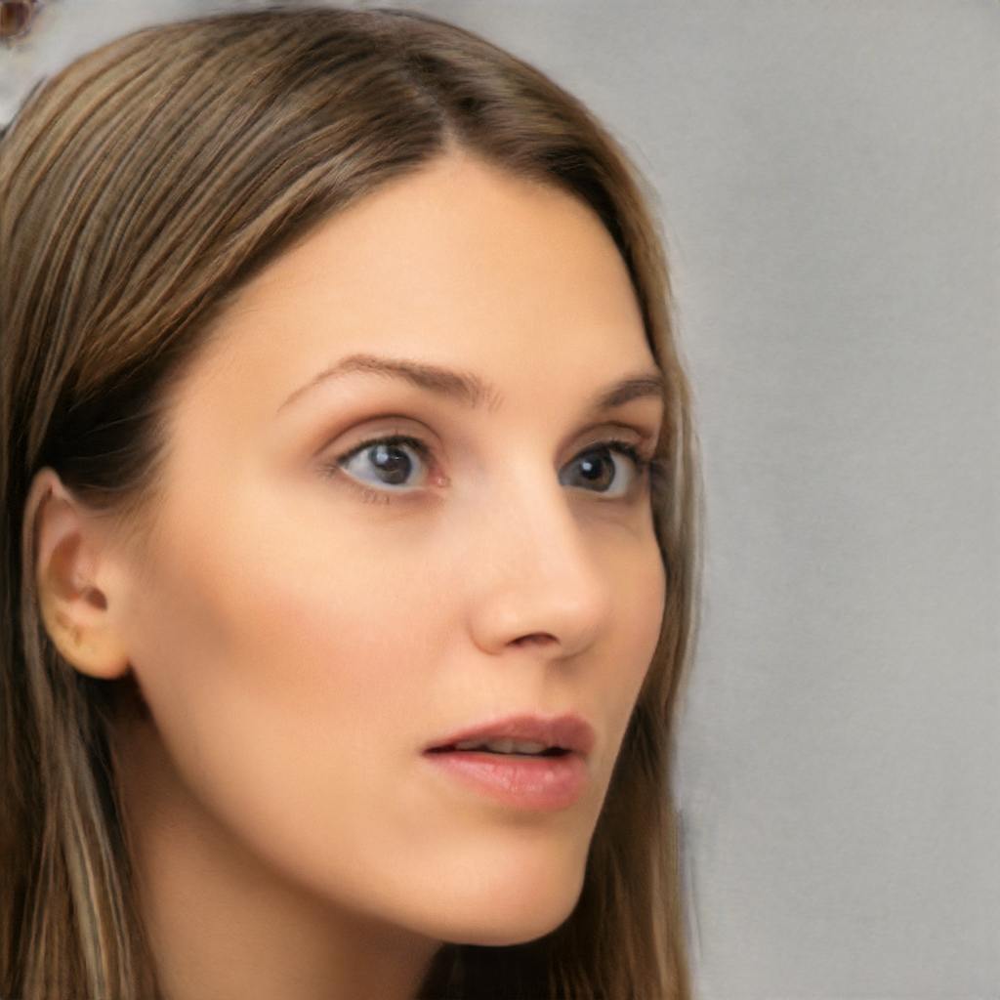
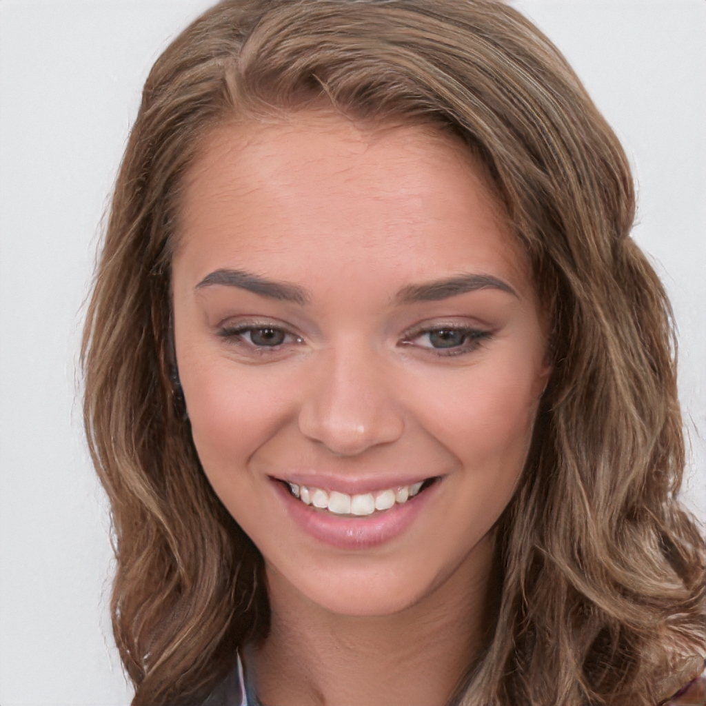
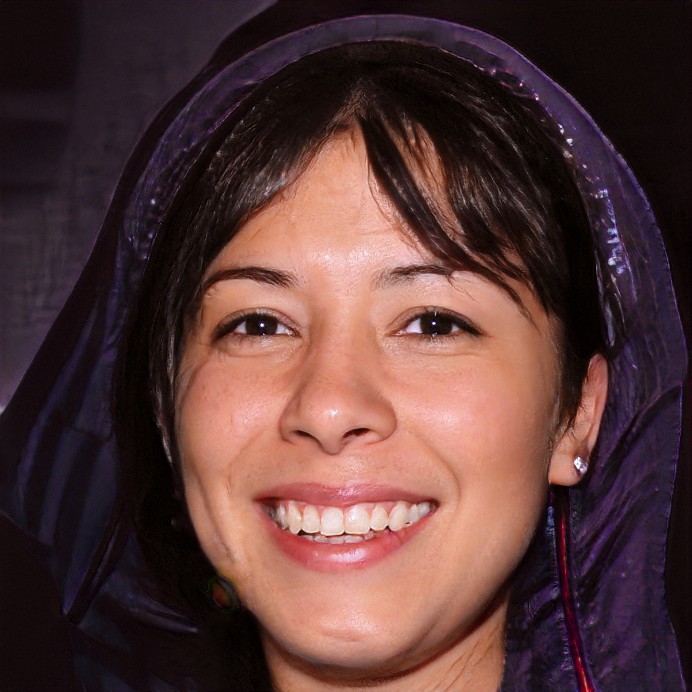
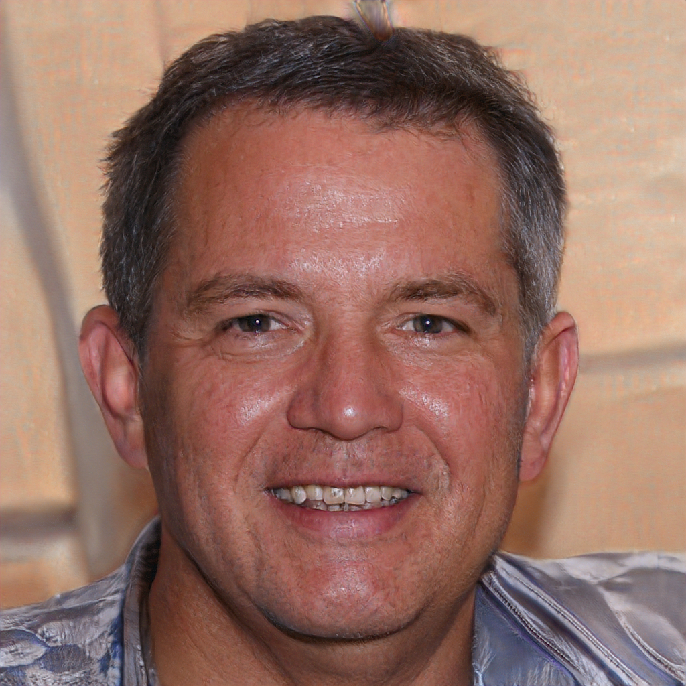
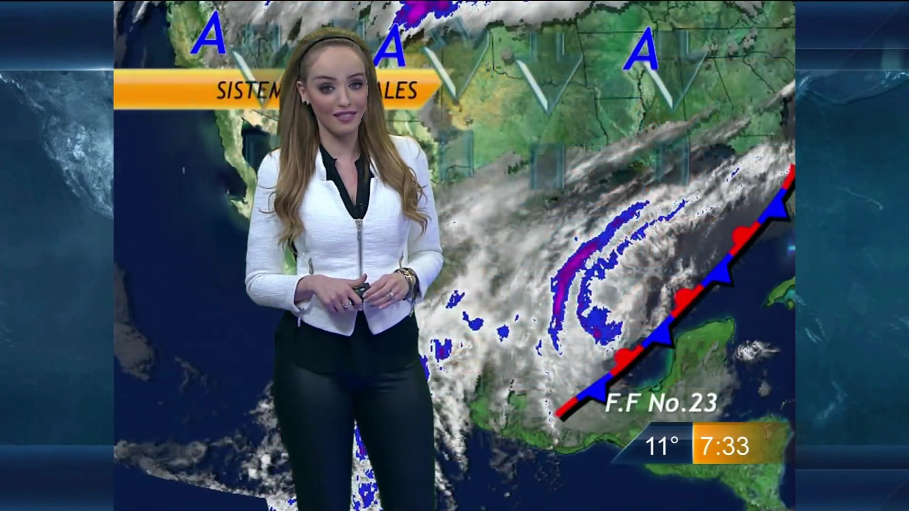
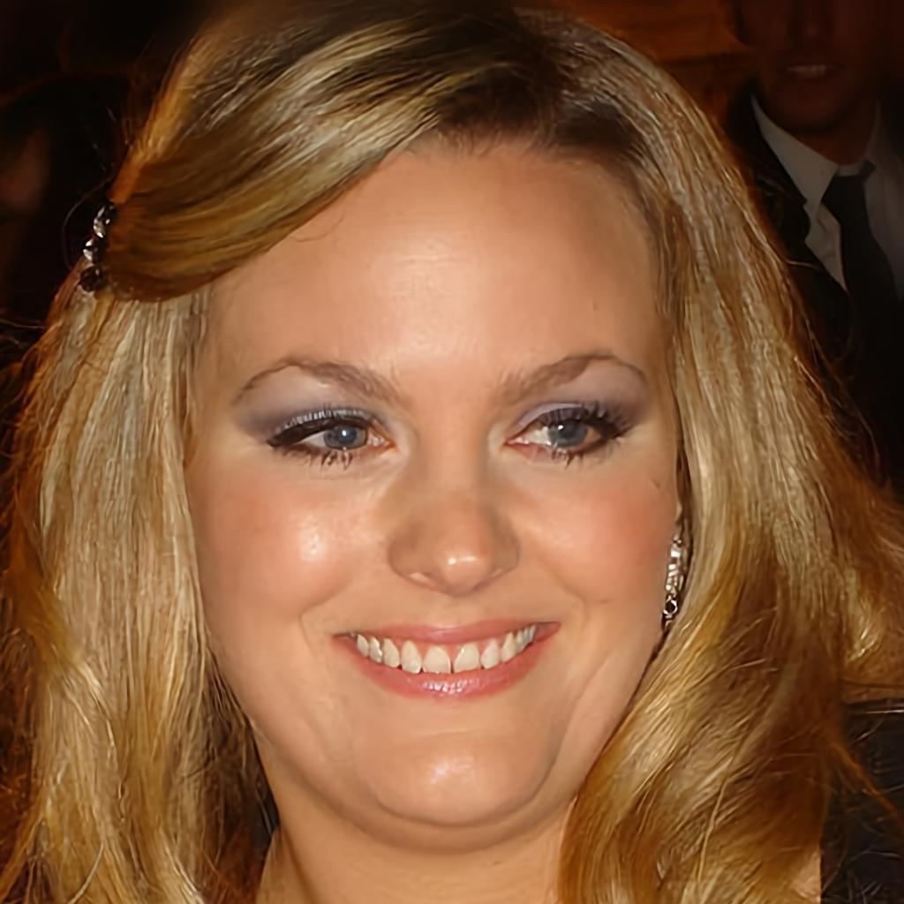

# 📊 MFAD Master Dataset Summary

> **471,720 total images** across **27 datasets** from **4 parent sources**, split roughly 80/20 train/test.

---

## At a Glance

```mermaid
graph TD
    A["MFAD Master Dataset<br/>471,720 images"] --> B["FF++ C23<br/>64,133 frames"]
    A --> C["Faces-HQ<br/>40,000 images"]
    A --> D["CelebA<br/>202,599 images"]
    A --> E["deepdetect25<br/>112,185 images"]
    A --> F["Stable Diffusion<br/>9,000 images"]
    A --> G["GAN Zoo & Extra<br/>43,803 images"]
    
    B --> B1["original (REAL)"]
    B --> B2["Deepfakes (FAKE)"]
    B --> B3["Face2Face (FAKE)"]
    B --> B4["FaceSwap (FAKE)"]
    B --> B5["FaceShifter (FAKE)"]
    B --> B6["NeuralTextures (FAKE)"]
    B --> B7["DeepFakeDetection (FAKE)"]
    
    C --> C1["Flickr-Faces-HQ (REAL)"]
    C --> C2["celebA-HQ (REAL)"]
    C --> C3["100KFake (FAKE)"]
    C --> C4["TPDNE (FAKE)"]
    
    D --> D1["celeba (REAL)"]
    E --> E1["deepdetect25 real+fake"]
    
    F --> F1["sd_1024 (FAKE)"]
    F --> F2["sd_768 (FAKE)"]
    F --> F3["sd_512 (FAKE)"]

    G --> G1["10x GANs (Mixed)"]
    G --> G2["deepfake subset"]
    G --> G3["whichfaceisreal"]

    style A fill:#1a1a2e,color:#fff
    style B fill:#16213e,color:#fff
    style C fill:#16213e,color:#fff
    style D fill:#16213e,color:#fff
    style E fill:#16213e,color:#fff
    style F fill:#16213e,color:#fff
    style G fill:#16213e,color:#fff
    
    style B1 fill:#0f3460,color:#fff
    style C1 fill:#0f3460,color:#fff
    style C2 fill:#0f3460,color:#fff
    style D1 fill:#0f3460,color:#fff
    
    style B2 fill:#e94560,color:#fff
    style B3 fill:#e94560,color:#fff
    style B4 fill:#e94560,color:#fff
    style B5 fill:#e94560,color:#fff
    style B6 fill:#e94560,color:#fff
    style B7 fill:#e94560,color:#fff
    style C3 fill:#e94560,color:#fff
    style C4 fill:#e94560,color:#fff
    style E1 fill:#533483,color:#fff
    
    style F1 fill:#e94560,color:#fff
    style F2 fill:#e94560,color:#fff
    style F3 fill:#e94560,color:#fff
    style G1 fill:#533483,color:#fff
    style G2 fill:#533483,color:#fff
    style G3 fill:#533483,color:#fff
```

---

## 🔵 Real Datasets

| Dataset | Parent | Train | Test | Total |
|---------|--------|------:|-----:|------:|
| `original` | FF++ | 8,543 | 2,211 | **10,754** |
| `celeba` | CelebA | 162,079 | 40,520 | **202,599** |
| `celebA-HQ_10K` | Faces-HQ | 8,000 | 2,000 | **10,000** |
| `Flickr-Faces-HQ_10K` | Faces-HQ | 8,000 | 2,000 | **10,000** |
| `deepdetect25` (real) | Custom | 48,815 | 11,377 | **60,192** |
| `AttGAN` (real) | GAN Zoo | 1,600 | 400 | **2,000** |
| `BEGAN` (real) | GAN Zoo | 1,600 | 400 | **2,000** |
| `CramerGAN` (real) | GAN Zoo | 1,600 | 400 | **2,000** |
| `InfoMaxGAN` (real) | GAN Zoo | 1,600 | 400 | **2,000** |
| `MMDGAN` (real) | GAN Zoo | 1,600 | 400 | **2,000** |
| `RelGAN` (real) | GAN Zoo | 1,600 | 400 | **2,000** |
| `SNGAN` (real) | GAN Zoo | 1,600 | 400 | **2,000** |
| `STGAN` (real) | GAN Zoo | 1,600 | 400 | **2,000** |
| `progan` (real) | GAN Zoo | 160 | 40 | **200** |
| `stargan` (real) | GAN Zoo | 1,599 | 400 | **1,999** |
| `whichfaceisreal` (real)| Extra | 800 | 200 | **1,000** |
| `deepfake` (real) | Extra | 2,165 | 542 | **2,707** |
| **Total Real** | | **251,361** | **64,090** | **315,451** |

## 🔴 Fake Datasets

| Dataset | Parent | Train | Test | Total | Deepfake Type |
|---------|--------|------:|-----:|------:|:---:|
| `Deepfakes` | FF++ | 8,458 | 2,189 | **10,647** | Partial |
| `Face2Face` | FF++ | 8,573 | 2,216 | **10,789** | Partial |
| `FaceSwap` | FF++ | 6,928 | 1,766 | **8,694** | Partial |
| `FaceShifter` | FF++ | 8,227 | 2,170 | **10,397** | Partial |
| `NeuralTextures` | FF++ | 6,687 | 1,721 | **8,408** | Partial |
| `DeepFakeDetection` | FF++/Google | 3,867 | 577 | **4,444** | Partial |
| `100KFake_10K` | Faces-HQ | 8,000 | 2,000 | **10,000** | Full |
| `thispersondoesntexists_10K` | Faces-HQ | 8,000 | 2,000 | **10,000** | Full |
| `deepdetect25` (fake) | Custom | 41,594 | 10,399 | **51,993** | Mixed |
| `stable_diffusion_512` | GitHub | 2,400 | 600 | **3,000** | Full (Diffusion) |
| `stable_diffusion_768` | GitHub | 2,400 | 600 | **3,000** | Full (Diffusion) |
| `stable_diffusion_1024`| GitHub | 2,400 | 600 | **3,000** | Full (Diffusion) |
| `AttGAN` (fake) | GAN Zoo | 1,600 | 400 | **2,000** | Attribute GAN |
| `BEGAN` (fake) | GAN Zoo | 1,600 | 400 | **2,000** | Full GAN |
| `CramerGAN` (fake) | GAN Zoo | 1,600 | 400 | **2,000** | Full GAN |
| `InfoMaxGAN` (fake) | GAN Zoo | 1,600 | 400 | **2,000** | Full GAN |
| `MMDGAN` (fake) | GAN Zoo | 1,600 | 400 | **2,000** | Full GAN |
| `RelGAN` (fake) | GAN Zoo | 1,600 | 400 | **2,000** | Full GAN |
| `SNGAN` (fake) | GAN Zoo | 1,600 | 400 | **2,000** | Full GAN |
| `STGAN` (fake) | GAN Zoo | 1,600 | 400 | **2,000** | Attribute GAN |
| `progan` (fake) | GAN Zoo | 160 | 40 | **200** | Full GAN |
| `stargan` (fake) | GAN Zoo | 1,599 | 400 | **1,999** | Multi-Domain |
| `whichfaceisreal` (fake)| Extra | 800 | 200 | **1,000** | Full GAN |
| `deepfake` (fake) | Extra | 2,158 | 540 | **2,698** | Partial Swap |
| **Total Fake** | | **123,451** | **32,818** | **156,269** | |

---

## 🧬 Deepfake Types Explained

> **⚠️ IMPORTANT:** Understanding the difference between **Fully Generated**, **Partially Manipulated**, and **Diffusion** deepfakes is critical — they require fundamentally different detection strategies.

### 🟣 Fully Generated (100% Synthetic - GANs)

These faces were **never real people**. The entire image — face, hair, background, clothing — is synthesized from a random latent vector by a GAN.

---

#### 100KFake_10K — StyleGAN Generated
- **Generator:** StyleGAN (NVIDIA)
- **Method:** Full face synthesis from random noise vector
- **Resolution:** 1024×1024
- **Detection Signal:** Frequency-domain anomalies are very reliable

| Sample 1 | Sample 2 |
|:---:|:---:|
|  |  |

---

#### thispersondoesntexists_10K — StyleGAN2 Generated
- **Generator:** StyleGAN2 (NVIDIA)
- **Method:** Full face synthesis — state-of-the-art photorealistic quality
- **Resolution:** 1024×1024
- **Detection Signal:** High-frequency spectral fingerprint, pupil irregularities

| Sample 1 | Sample 2 |
|:---:|:---:|
|  |  |

---

#### The GAN Zoo (BEGAN, CramerGAN, InfoMaxGAN, MMDGAN, RelGAN, SNGAN, progan)
- **Generator Families:** Various core GAN variants optimizing different discriminator paradigms (e.g. Spectral Normalization, Maximum Mean Discrepancy). 
- **Method:** Full generative face synthesis.
- **Detection Signal:** Highly specific spectral fingerprints tied to generator upsampling logic.

| SNGAN Sample (Fake) | progan Sample (Fake) |
|:---:|:---:|
|  |  |

---

### 🟢 Fully Generated (100% Synthetic - Diffusion)

#### Stable Diffusion Face Dataset (512, 768, 1024)
- **Generator:** Stable Diffusion
- **Source:** https://github.com/tobecwb/stable-diffusion-face-dataset.git
- **Method:** Text-condition/Latency diffusion denoising. Separated precisely into high-res brackets (512, 768, 1024).
- **Detection Signal:** Unlike GANs, diffusion models don't exhibit straightforward upsampling grid patterns, but leave high-frequency high-variance noise traces. Very susceptible to VLM-based detection.

| SD 512 (Fake) | SD 768 (Fake) | SD 1024 (Fake) |
|:---:|:---:|:---:|
|  |  |  |

---

### 🔴 Partially Manipulated (Real Video, Face Modified)

These start with a **real video of a real person**. Only the face region is modified.

---

#### Deepfakes, FaceSwap, FaceShifter, deepfake (Autoencoder Face Swaps)
- **Method:** Autoencoder or GAN transferring identity.
- **What Changes:** Face region replaced with another person's face
- **Detection Signal:** Blending boundaries, color mismatch at face edges

| Deepfakes Sample | FaceShifter Sample | Custom Deepfake Sample |
|:---:|:---:|:---:|
|  |  |  |

---

#### AttGAN, STGAN, StarGAN (Facial Attribute Editing)
- **Method:** Latent space attribute manipulation (e.g. adding glasses, changing hair color, aging).
- **What Changes:** Isolated sub-features. Identity remains.
- **Detection Signal:** Localized structural disparities around eyes or hair.

| AttGAN Fake | STGAN Fake | StarGAN Fake |
|:---:|:---:|:---:|
|  |  |  |

---

#### Face2Face & NeuralTextures (Facial Reenactment)
- **Method:** Transfers expressions/neural re-renders mouth.
- **Detection Signal:** Unnatural mouth movements, expression inconsistencies

| Face2Face Sample | NeuralTextures Sample |
|:---:|:---:|
|  |  |

---

### 🔵 Real Face Datasets

Baselines representing authentic unmanipulated distributions.

| FF++ Original | FFHQ | CelebA-HQ | WhichFaceIsReal (Real) |
|:---:|:---:|:---:|:---:|
|  |  |  |  |

---

## 🎯 Detection Difficulty Ranking

| Rank | Dataset | Type | Difficulty | Why |
|:---:|---------|------|:---:|-----|
| 1 | `NeuralTextures` | Neural rendering | 🔴 Very Hard | Only mouth region modified |
| 2 | `DeepFakeDetection` | Production DFD | 🔴 Very Hard | Professional quality masks artifacts |
| 3 | `Stable Diffusion` | Diffusion | 🟠 Hard | Lacks traditional GAN upsampling artifacts |
| 4 | `FaceShifter` | GAN face swap | 🟠 Hard | State-of-the-art GAN, clean output |
| 5 | `Face2Face` | Reenactment | 🟠 Hard | Minimal pixel-level changes |
| 6 | `AttGAN` / `STGAN` | Attribute Edit | 🟡 Medium | Changes are highly localized |
| 7 | `Deepfakes` | Autoencoder swap | 🟡 Medium | Blending boundaries detectable |
| 8 | `FaceSwap` | CG face swap | 🟡 Medium | Geometric distortion visible |
| 9 | `TPDNE` | StyleGAN2 full gen | 🟡 Medium | Frequency fingerprint reliable |
| 10 | `GAN Zoo Models` | Various GANs | 🟢 Easier | Strong spectral fingerprints |
| 11 | `100KFake` | StyleGAN full gen | 🟢 Easier | Upsampling artifacts detectable |

---

## 🔬 Which Dataset for Which MFAD Agent?

> **💡 TIP:** Different agents excel at detecting different manipulation types. Train each agent on datasets where its signal is strongest.

| MFAD Agent | Primary Signal | Best Training Datasets | Why |
|-----------|---------------|----------------------|-----|
| **Frequency Agent** (FFT + SVM) | Spectral fingerprints | `GAN Zoo`, `100KFake`, `TPDNE` | GAN upsampling creates predictable frequency anomalies |
| **Texture Agent** (LBP + Gabor) | Blending seams | `Deepfakes`, `FaceSwap`, `AttGAN` | Face-background boundary creates texture discontinuities |
| **Geometry Agent** (Landmarks) | Facial proportions | `FaceSwap`, `Face2Face` | Geometric warping distorts landmark positions |
| **Biological Agent** (Pupil/Iris) | Eye realism | All FF++ types | All manipulations affect pupil shape and corneal reflections |
| **VLM Agent** (LLaVA) | Semantic coherence | `Stable Diffusion`, All datasets | VLMs handle complex semantic generation errors effectively |
| **Metadata Agent** (EXIF/ELA) | Compression traces | All datasets | Editing software and re-compression leave forensic trails |

---

*Dataset prepared: April 2026 • Seed: 42 • Split: 80% train / 20% test*
