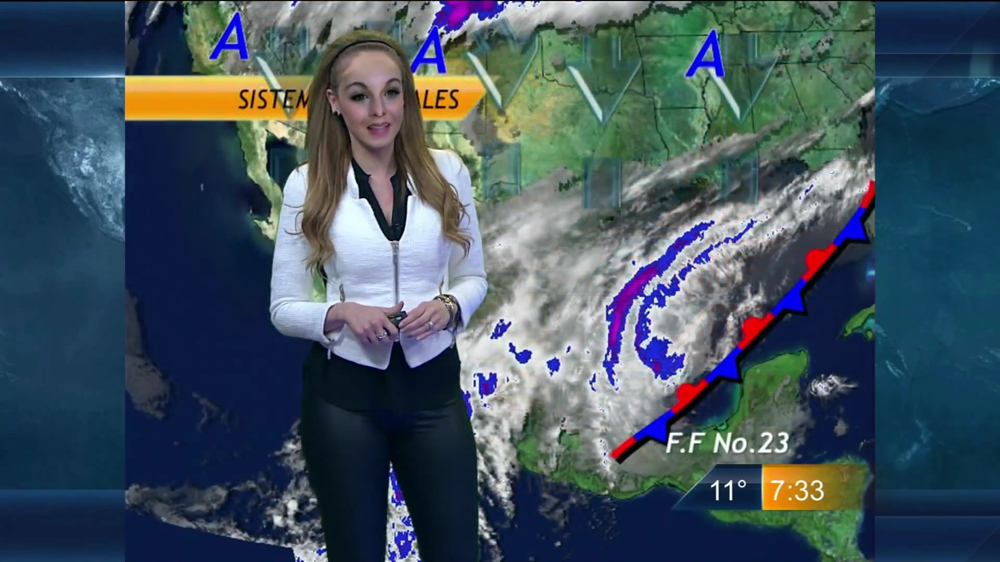
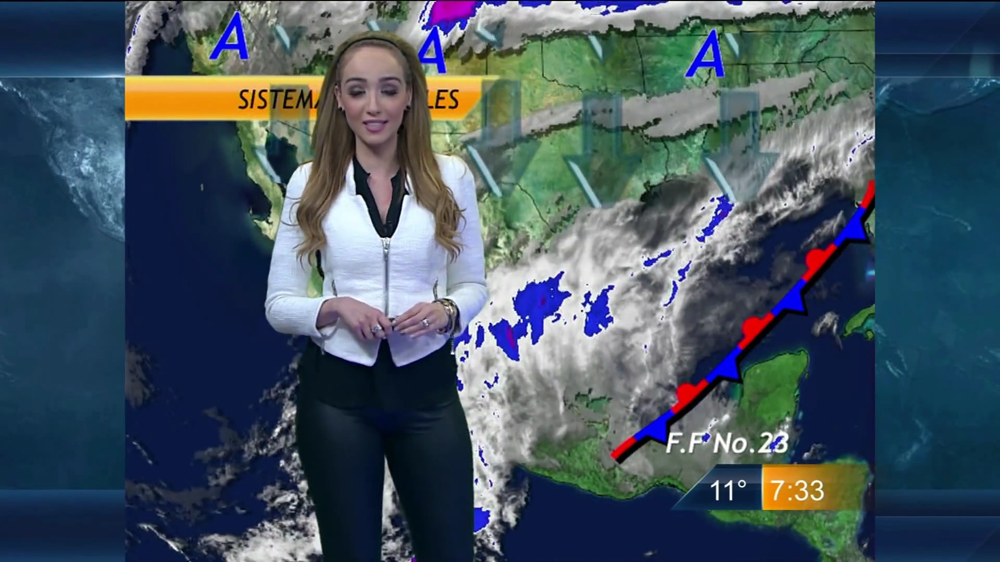
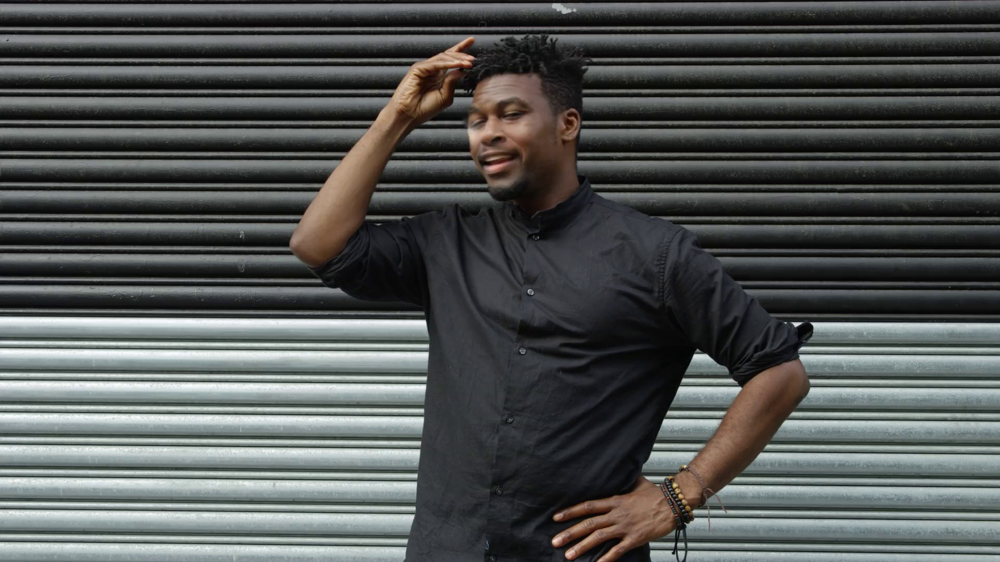
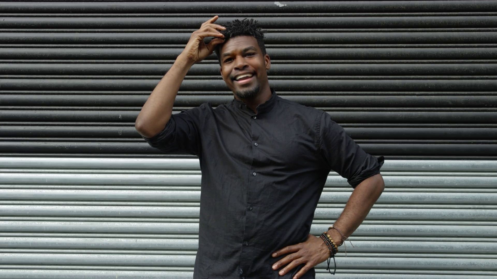
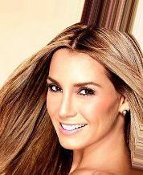
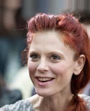
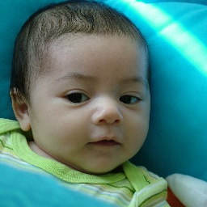

# 📊 MFAD Master Dataset Summary

> **397,167 total images** across **12 datasets** from **3 parent sources**, split 80/20 at video/image level

---

## At a Glance

```mermaid
graph TD
    A["MFAD Master Dataset<br/>397,167 images"] --> B["FF++ C23<br/>64,133 frames"]
    A --> C["Faces-HQ<br/>40,000 images"]
    A --> D["CelebA<br/>202,599 images"]
    A --> E["deepdetect25<br/>112,185 images"]
    
    B --> B1["original (REAL)"]
    B --> B2["Deepfakes (FAKE)"]
    B --> B3["Face2Face (FAKE)"]
    B --> B4["FaceSwap (FAKE)"]
    B --> B5["FaceShifter (FAKE)"]
    B --> B6["NeuralTextures (FAKE)"]
    B --> B7["DeepFakeDetection (FAKE)"]
    
    C --> C1["Flickr-Faces-HQ (REAL)"]
    C --> C2["celebA-HQ (REAL)"]
    C --> C3["100KFake (FAKE)"]
    C --> C4["TPDNE (FAKE)"]
    
    D --> D1["celeba (REAL)"]
    E --> E1["deepdetect25 real+fake"]

    style A fill:#1a1a2e,color:#fff
    style B fill:#16213e,color:#fff
    style C fill:#16213e,color:#fff
    style D fill:#16213e,color:#fff
    style E fill:#16213e,color:#fff
    style B1 fill:#0f3460,color:#fff
    style C1 fill:#0f3460,color:#fff
    style C2 fill:#0f3460,color:#fff
    style D1 fill:#0f3460,color:#fff
    style B2 fill:#e94560,color:#fff
    style B3 fill:#e94560,color:#fff
    style B4 fill:#e94560,color:#fff
    style B5 fill:#e94560,color:#fff
    style B6 fill:#e94560,color:#fff
    style B7 fill:#e94560,color:#fff
    style C3 fill:#e94560,color:#fff
    style C4 fill:#e94560,color:#fff
    style E1 fill:#533483,color:#fff
```

---

## 🔵 Real Datasets

| Dataset | Parent | Train | Test | Total |
|---------|--------|------:|-----:|------:|
| `original` | FF++ | 8,543 | 2,211 | **10,754** |
| `celeba` | CelebA | 162,079 | 40,520 | **202,599** |
| `celebA-HQ_10K` | Faces-HQ | 8,000 | 2,000 | **10,000** |
| `Flickr-Faces-HQ_10K` | Faces-HQ | 8,000 | 2,000 | **10,000** |
| `deepdetect25` (real) | Custom | 48,815 | 11,377 | **60,192** |
| **Total Real** | | **235,437** | **58,108** | **293,545** |

## 🔴 Fake Datasets

| Dataset | Parent | Train | Test | Total | Deepfake Type |
|---------|--------|------:|-----:|------:|:---:|
| `Deepfakes` | FF++ | 8,458 | 2,189 | **10,647** | Partial |
| `Face2Face` | FF++ | 8,573 | 2,216 | **10,789** | Partial |
| `FaceSwap` | FF++ | 6,928 | 1,766 | **8,694** | Partial |
| `FaceShifter` | FF++ | 8,227 | 2,170 | **10,397** | Partial |
| `NeuralTextures` | FF++ | 6,687 | 1,721 | **8,408** | Partial |
| `DeepFakeDetection` | FF++/Google | 3,867 | 577 | **4,444** | Partial |
| `100KFake_10K` | Faces-HQ | 8,000 | 2,000 | **10,000** | Full |
| `thispersondoesntexists_10K` | Faces-HQ | 8,000 | 2,000 | **10,000** | Full |
| `deepdetect25` (fake) | Custom | 41,594 | 10,399 | **51,993** | Mixed |
| **Total Fake** | | **100,334** | **25,038** | **125,372** | |

---

## 🧬 Deepfake Types Explained

> **⚠️ IMPORTANT:** Understanding the difference between **Fully Generated** and **Partially Manipulated** deepfakes is critical — they require fundamentally different detection strategies.

### 🟣 Fully Generated (100% Synthetic)

These faces were **never real people**. The entire image — face, hair, background, clothing — is synthesized from a random latent vector by a GAN. No source image is manipulated.

---

#### 100KFake_10K — StyleGAN Generated
- **Generator:** StyleGAN (NVIDIA)
- **Method:** Full face synthesis from random noise vector
- **Resolution:** 1024×1024
- **Key Artifacts:** Upsampling grid patterns, checkerboard artifacts in FFT spectrum
- **Detection Signal:** Frequency-domain anomalies are very reliable

| Sample 1 | Sample 2 |
|:---:|:---:|
|  |  |

---

#### thispersondoesntexists_10K — StyleGAN2 Generated
- **Generator:** StyleGAN2 (NVIDIA) via ThisPersonDoesNotExist.com
- **Method:** Full face synthesis — state-of-the-art photorealistic quality
- **Resolution:** 1024×1024
- **Key Artifacts:** Characteristic high-frequency spectral fingerprint, subtle pupil/iris irregularities
- **Detection Signal:** Harder than StyleGAN1 — requires robust frequency analysis

| Sample 1 | Sample 2 |
|:---:|:---:|
|  |  |

---

### 🔴 Partially Manipulated (Real Video, Face Modified)

These start with a **real video of a real person**. Only the face region is modified — the body, background, and audio remain authentic. This is what most real-world deepfakes look like.

---

#### Deepfakes — Autoencoder Face Swap
- **Paper:** Rössler et al., FaceForensics++ (2019)
- **Method:** Autoencoder network trained on source+target → swaps identity
- **What Changes:** Face region replaced with another person's face
- **What Stays:** Background, hair, body, audio
- **Artifacts:** Blending boundaries, color mismatch at face edges, temporal flickering

| Sample 1 | Sample 2 |
|:---:|:---:|
|  |  |

---

#### Face2Face — Facial Reenactment
- **Paper:** Thies et al., CVPR 2016
- **Method:** Transfers expressions from source actor to target face
- **What Changes:** Inner face only (mouth, eyes, eyebrows) — identity preserved
- **What Stays:** Face identity, outer face, background
- **Artifacts:** Unnatural mouth movements, expression inconsistencies

| Sample 1 | Sample 2 |
|:---:|:---:|
|  |  |

---

#### FaceSwap — CG-Based Face Swap
- **Method:** 3D face fitting + Poisson blending (no ML)
- **What Changes:** Face region geometrically warped and blended
- **What Stays:** Body, background, lighting (attempted match)
- **Artifacts:** Geometric distortion, illumination mismatch, visible seams

| Sample 1 | Sample 2 |
|:---:|:---:|
|  |  |

---

#### FaceShifter — GAN-Based Face Swap
- **Paper:** Li et al., CVPR 2020
- **Method:** Two-stage GAN (AEI-Net) — highest quality face swap
- **What Changes:** Face identity replaced while preserving pose, lighting, expression
- **What Stays:** All attributes except identity — very clean output
- **Artifacts:** Subtle frequency anomalies only, minor color shifts

| Sample 1 | Sample 2 |
|:---:|:---:|
|  |  |

---

#### NeuralTextures — Neural Rendering
- **Paper:** Thies et al., SIGGRAPH 2019
- **Method:** Neural texture map re-renders the face with modified expressions
- **What Changes:** Mouth region only — most subtle manipulation in FF++
- **What Stays:** Everything except the mouth area
- **Artifacts:** Mouth texture inconsistencies, slight lip blur, frequency artifacts

| Sample 1 | Sample 2 |
|:---:|:---:|
|  |  |

---

#### DeepFakeDetection — Google Production Deepfakes
- **Source:** Google DFD dataset with consenting actors
- **Method:** Professional actor-based deepfakes in controlled environments
- **What Changes:** Face swap with high production quality
- **Artifacts:** Very subtle — professional lighting masks typical artifacts

| Sample 1 | Sample 2 |
|:---:|:---:|
|  |  |

---

### 🔵 Real Face Datasets

#### FF++ Original — Real YouTube Frames
- **Source:** 1,000 YouTube videos of real people
- **Use:** Baseline real distribution for video-based detectors

| Sample 1 | Sample 2 |
|:---:|:---:|
|  |  |

---

#### Flickr-Faces-HQ — Real Flickr Portraits
- **Source:** NVIDIA FFHQ — 10K real face images from Flickr (1024×1024)
- **Use:** High-quality real baseline for GAN detection tasks

| Sample 1 | Sample 2 |
|:---:|:---:|
|  |  |

---

#### celebA-HQ — Real Celebrity Faces (HQ)
- **Source:** CelebA-HQ — 10K high-res celebrity photos (1024×1024)
- **Use:** Real baseline paired with GAN-generated datasets

| Sample 1 | Sample 2 |
|:---:|:---:|
|  |  |

---

#### CelebA — Large-Scale Celebrity Faces
- **Source:** Liu et al., ICCV 2015 — 202K aligned celebrity photos (178×218)
- **Use:** Largest real dataset — high diversity for robust training

| Sample 1 | Sample 2 |
|:---:|:---:|
|  |  |

---

#### deepdetect25 — Custom Mixed Dataset
- **Source:** Custom collected real and fake images
- **Use:** Additional training data diversity

| Real Sample | Fake Sample |
|:---:|:---:|
|  |  |

---

## 🎯 Detection Difficulty Ranking

| Rank | Dataset | Type | Difficulty | Why |
|:---:|---------|------|:---:|-----|
| 1 | `NeuralTextures` | Neural rendering | 🔴 Very Hard | Only mouth region modified |
| 2 | `DeepFakeDetection` | Production DFD | 🔴 Very Hard | Professional quality masks artifacts |
| 3 | `FaceShifter` | GAN face swap | 🟠 Hard | State-of-the-art GAN, clean output |
| 4 | `Face2Face` | Reenactment | 🟠 Hard | Minimal pixel-level changes |
| 5 | `Deepfakes` | Autoencoder swap | 🟡 Medium | Blending boundaries detectable |
| 6 | `FaceSwap` | CG face swap | 🟡 Medium | Geometric distortion visible |
| 7 | `TPDNE` | StyleGAN2 full gen | 🟡 Medium | Frequency fingerprint reliable |
| 8 | `100KFake` | StyleGAN full gen | 🟢 Easier | Upsampling artifacts detectable |

---

## 🔬 Which Dataset for Which MFAD Agent?

> **💡 TIP:** Different agents excel at detecting different manipulation types. Train each agent on datasets where its signal is strongest.

| MFAD Agent | Primary Signal | Best Training Datasets | Why |
|-----------|---------------|----------------------|-----|
| **Frequency Agent** (FFT + SVM) | Spectral fingerprints | `100KFake`, `TPDNE`, `Flickr-HQ`, `celebA-HQ` | GAN upsampling creates predictable frequency anomalies |
| **Texture Agent** (LBP + Gabor) | Blending seams | `Deepfakes`, `FaceSwap`, `Face2Face` | Face-background boundary creates texture discontinuities |
| **Geometry Agent** (Landmarks) | Facial proportions | `FaceSwap`, `Face2Face` | Geometric warping distorts landmark positions |
| **Biological Agent** (Pupil/Iris) | Eye realism | All FF++ types | All manipulations affect pupil shape and corneal reflections |
| **VLM Agent** (LLaVA) | Semantic coherence | All datasets | VLMs detect semantic inconsistencies across all fake types |
| **Metadata Agent** (EXIF/ELA) | Compression traces | All datasets | Editing software and re-compression leave forensic trails |

---

*Dataset prepared: April 2026 • Seed: 42 • Split: 80% train / 20% test*
